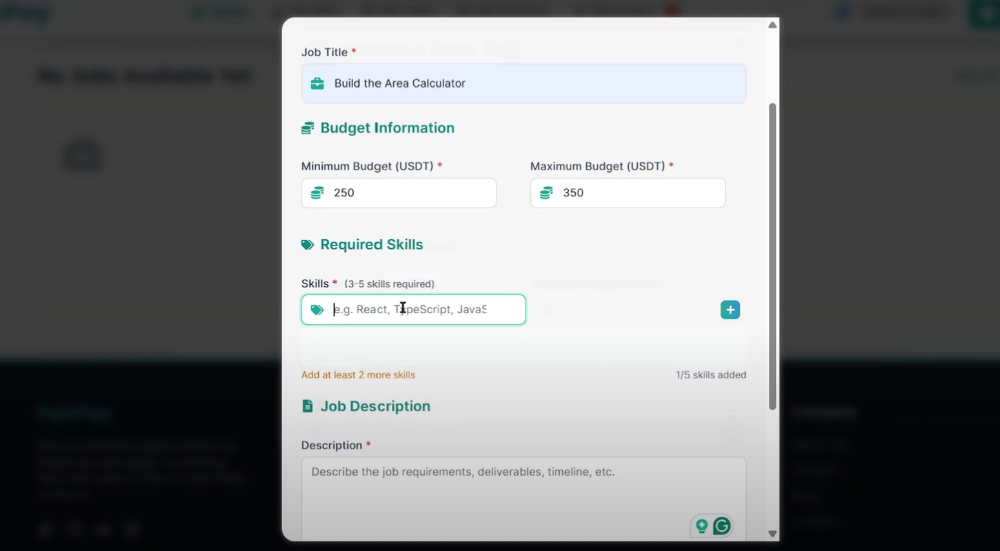

# Project Information

SafeWorkPay is a freelancing platform for **IT projects and coding tasks**. It uses **Blockchain** and **AI** technology to make sure clients and freelancers have a **secure and fair experience**.

Here's how it works:

- **Blockchain** handles all payments, so transactions are transparent and secure.
- In Case of **Dispute** **AI** checks the code submitted by freelancers and check the **completion percentage** of the project.
- This approach helps avoid the common problems with other platforms, like **high fees, payment delays, biased and manual dispute resolution**.

---

## Submission Information

- Live Link https://safework-pay-sonic.vercel.app/
- Presentation video: https://www.youtube.com/watch?v=mEUXgj6l0L4

---

## 📜 Deployment Notes

#### Sonic Testnet

The smart contracts are already deployed on the **Sonic Testnet** at the following addresses:

| Contract Name | Address                                                                                                                            |
| ------------- | ---------------------------------------------------------------------------------------------------------------------------------- |
| **DappWorks** | [`0xF2011cFE8E379A4A890A7f1a5CDCC61629A2FA6b`](https://testnet.sonicscan.org/address/0xF2011cFE8E379A4A890A7f1a5CDCC61629A2FA6b) |
| **USDT**      | [`0x7BBfC9Ea272595D794990A8C2ea615d95ECe3673`](https://testnet.sonicscan.org/address/0x7BBfC9Ea272595D794990A8C2ea615d95ECe3673) |

🔗 _You can visit the [Sonic Testnet Explorer](https://testnet.sonicscan.org/) to check the transactions._

---

## Problem Statement

- Freelancing platforms often face **payment disputes and trust issues**.
- Clients may **withhold funds** even when work is completed.
- Developers may **fail to deliver** after receiving payment.
- These issues **discourage honest participation** and reduce efficiency.
- There’s a **need for a secure, transparent, and fair system** to build trust between **clients** and **freelancers**.

---

## Solution Overview

- **SafeWorkPay** is a **decentralized freelancing platform** powered by **blockchain and AI**.
- Clients deposit funds into a **smart contract**, which **holds the money in escrow**.
- **Funds are released** only when full projects are **completed and verified**.
- In case of **Dispute** **AI** checks the code submitted by freelancers and check the **completion percentage** of the project.
- The AI helps in **resolving disputes** fairly by releasing funds **proportionally** (e.g., 50% work = 50% payment).
- SafeWorkPay is better than other platforms because it combines two powerful technologies:

  - **Blockchain's trust:** This makes payments secure and transparent.
  - **AI's analysis:** This checks the quality of the code automatically.

This makes it more reliable than traditional platforms like **Upwork** or simpler blockchain-based platforms like **Ethlance**, which don't have this combination of features.

---

## How SafeWorkPay Works

1.  **Project Posting:** A client posts a project with a title, description, keywords, and a budget range.
2.  **Bidding:** Freelancers submit bids that fit within the client's budget.
3.  **Hiring:** The client accepts a bid, and the agreed-upon payment is locked in a secure smart contract.
4.  **Work Submission:** The freelancer finishes the project and provides a link to the completed code on GitHub.
5.  **Review and Payment:**
    - **If the client approves the work,** the full payment is instantly released to the freelancer.
    - **If the client doesn't approve,** either party can start a dispute.
6.  **Dispute Resolution:** An AI system analyzes the project's details and the submitted code to determine the percentage of completion. Based on this analysis, the funds are split fairly between the client and the freelancer.

---

## Key Advantages

- **Low Fees:** Transaction fees are very low, regardless of the project's size.
- **Fast Payments:** Payments are instant and work across different countries without the delays or currency issues of traditional banks.
- **Quick Disputes:** An AI-powered system resolves disputes 24/7, offering a fast, accurate, and unbiased solution.
- **No Middlemen:** Smart contracts handle payments directly, making the process transparent and immediate.
- **Specialized and Accurate:** Because the platform focuses only on IT projects, the AI can analyze code to resolve disputes with high accuracy.

## 📸 Screenshots

Below are screenshots showcasing different pages and functionalities of **SafeWorkPay**. These images are placeholders from the `public` folder.

---

### 1. 🏠 Homepage


> View the landing page listing all available freelance projects.

---

### 2. 📝 Post a Project



> Clients can post new freelance projects with required details.

---

### 3. 📋 Manage Project


> Track and manage project updates, delete projects, and view bids.

---

### 4. 💼 Bidding Interface


> View bids on a project.


> clients can view bids placed on their projects.

---

### 5. 🧑‍💻 My Job


> Freelancers can see all the projects they have assigned.

---

### 6. 📁 My Projects


> Clients can see all projects they’ve created and assigned. also pay for the projects and chat with freelancers.

---

### 7. 💬 Messages / Chat


> Real-time communication between clients and freelancers using comet chat.

---

### 8. ⚠️ Dispute Raise


> Raise a dispute if a disagreement arises regarding the project.

---

### 9. 🛠️ Admin Dashboard


> Admin can monitor and handle disputes from the backend.

---

### 10. 🧑‍⚖️ Dispute Resolve


> The system (with AI help) resolves disputes based on task completion and pay amount to freelancers and clients.

---

### 11. ✅ Project Completion


> Freelancers can see all the projects they have completed and payment status of the projects.

---

### 12. 🤖 AI Project Completion Evaluation


> AI agent evaluates task completion and assists in dispute resolution.

---

## Installation and Running the Frontend

To run the SafeWorkPay frontend, follow these steps:

1. **Install Dependencies**

   ```bash
   pnpm install
   ```

2. **Start the Frontend**
   ```bash
   pnpm start
   ```

**Environment Setup**: Make sure to add your MetaMask private key, CometChat credentials, and RPC URL in the `.env` file for the application to function correctly.

#### add the environment variables in the .env file

```
 REACT_APP_COMET_CHAT_APP_ID=
 REACT_APP_COMET_CHAT_AUTH_KEY=
 REACT_APP_COMET_CHAT_REGION=
 REACT_APP_RPC_URL=http://127.0.0.1:8545
```

## Running the AI Agent

The AI Agent is a separate component that assists in dispute resolution by evaluating code completeness. To run it:

1. **Frontend Setup for AI Agent**
   - Navigate to the AI-Agent/frontend directory:
     ```bash
     cd AI-Agent/frontend
     ```
   - Install dependencies:
     ```bash
     pnpm install
     ```
   - Start the frontend:
     ```bash
     pnpm start
     ```

change file name .env.example to .env and add the environment variables in the .env file in frontend directory.

2. **Backend Setup for AI Agent**
   - Navigate to the backend directory of the AI Agent:
     ```bash
     cd AI-Agent/backend
     ```
   - Install dependencies:
     ```bash
     pnpm install
     ```
   - Start the backend server:
     ```bash
     pnpm start
     ```

**Note**: Ensure you add your Gemini API key in the appropriate configuration file .env for the AI Agent to work correctly.

## Tools and Technologies Used

- **Frontend**: React, React Router, Tailwind CSS, react-hooks-global-state, ethers.js, react-toastify
- **Backend (Smart Contracts)**: Solidity, Hardhat, OpenZeppelin Contracts, Node.js, Express.js, @google/generative-ai
- **Chat Functionality**: CometChat
- **Package Manager**: pnpm
- **Blockchain**: Sonic Testnet
- **AI**: Custom AI model for code evaluation and dispute resolution (integrated with Gemini API)

## Additional Notes

- **Security**: The platform uses blockchain for secure escrow and transparent transactions.
- **User Authentication**: Users must connect their **MetaMask** wallets to interact with the platform.
- **Chat**: Real-time messaging between clients and freelancers is facilitated via **CometChat**.
- **Dispute Resolution**: A unique feature where AI aids in fair resolution, ensuring partial payments for partial work.

For any issues or contributions, please open an issue or pull request on this repository. We welcome feedback to improve SafeWorkPay!

---

_Built with ❤️ by the SafeWorkPay team_
